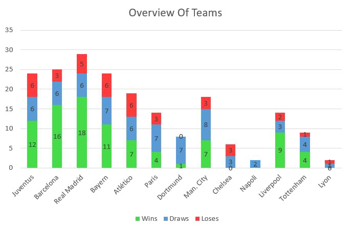
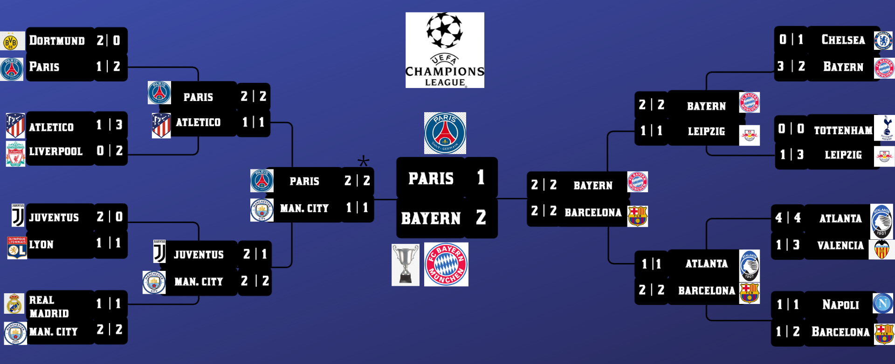

# whatif
Repository for the work on ECML WhatIf Challenge

Here is a quick summary for relavent teams in the UCL dataset created by us:

We used an autoencoder more for predicting the match statistics of each of the remaining games in detail, including Scoreline , Possession, Passes, Blocks and also stats like which player scored the goals, assissts, interceptions, crosses for every player. We used this model to run a simulation and determine which team would have won the Champions League had the season not been interrupted due to the Corona Virus. We inferred that our model was able to capture interactions among features very well and our predictions were robust and realistic.

The final results of our simulation were as follows:

AUTHORS:
1. Ashwin Vaswani 
2. Rijul Ganguly
3. Het Shah
4. Sharan Ranjit
5. Shrey Pandit
6. Samruddhi Bothara

CONTRIBUTORS:
1. Raja Narasimhan
